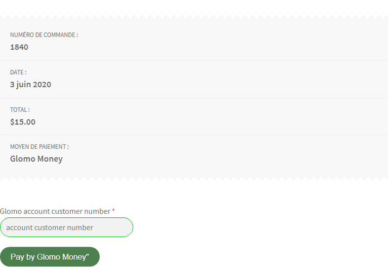
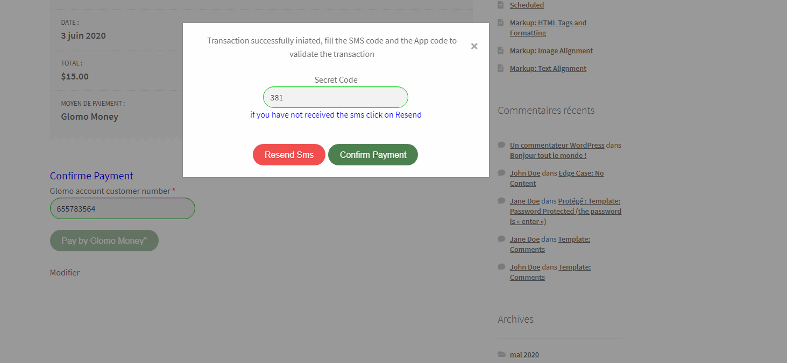
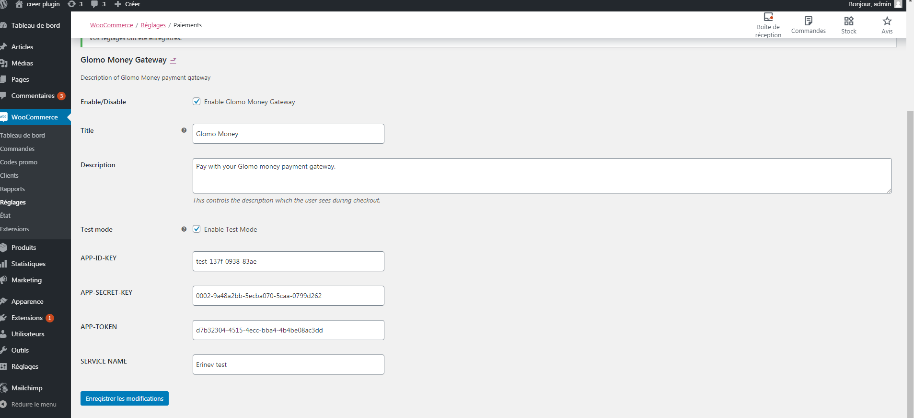

# Glomo Woocommerce Payment Plugin

Contributors: Paki leonel
Donate link: 
Tags: payment, Mobile Payment, Payment Gateways
Requires at least: 4.0
Tested up to: 4.8
Stable tag: trunk
Requires PHP: 5.4
License: GPLv2 or later
License URI: https://www.gnu.org/licenses/gpl-2.0.html

## Description

 ### About GloMo Money

In today’s digital world, Glomo money enables individuals and businesses to connect with each other and grow through our e-wallet platform. With our flexible, secure and low-cost solutions, vendors, businesses and professionals can pay and get paid so easily.

 ### ABOUT THE PLUGIN

The plugin allows you to use Glomo Money payment gateway with the WooCommerce plugin. The plugin uses an jquery form.

### FEATURES

Pay with Glomo Money`

## Download 
```html
https://github.com/glomoapp/glomo_woocommerce_payment_plugin/blob/master/wc_glomo.zip
```

## Installation 
first download the unzipped zip file and recover the wc_glomo.zip


In your WordPress Dashboard go to  »Plugins » -> »Add Plugin ».

Search for »Glomo Money Woocommerce Gateway»
or upload your wc_glomo.zip

Install the plugin by pressing the  »Install » button.

Activate the plugin by pressing the  »Activate » button.

Open the settings page for WooCommerce and click the  »Checkout » tab.

Click on the sub tab for  »Glomo Money ».
Configure your Glomo Money Gateway settings.

### MINIMUM REQUIREMENTS

WordPress version 3.0 or greater.
PHP version 5.2.4 or greater.
MySQL version 5.0 or greater.

### RECOMMENDED REQUIREMENTS

Latest WordPress version.
PHP version 5.6 or greater.
MySQL version 5.6 or greater.

## Frequently Asked Questions

= What is the cost for the gateway plugin? =

This plugin is a FREE download.


== Screenshots ==
 
 
